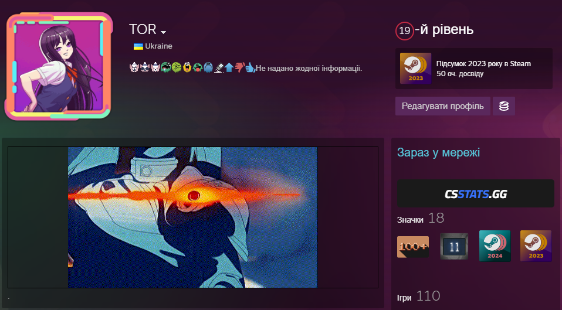
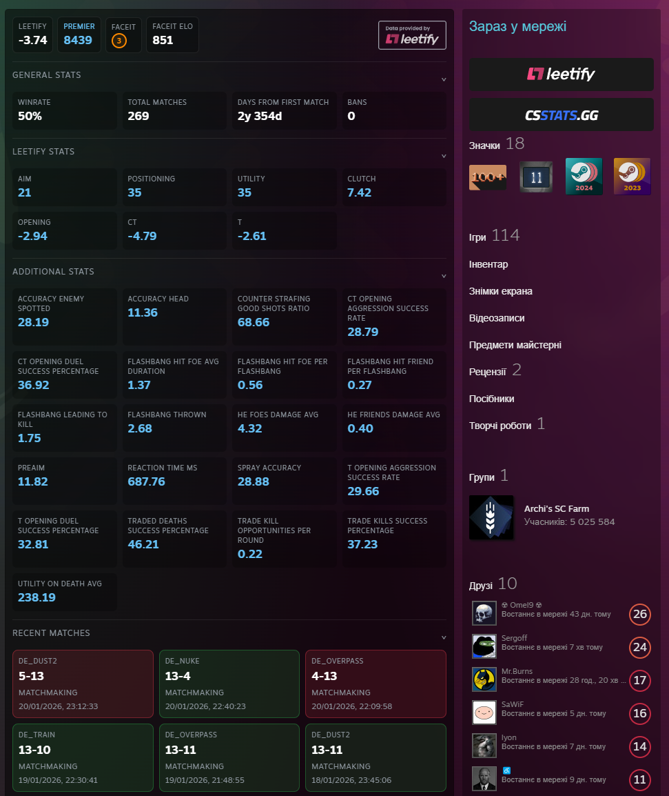
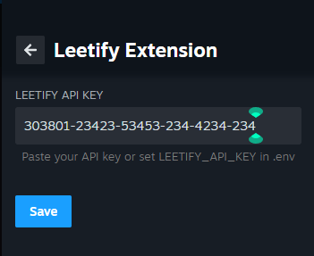

# Leetify Extension for Millennium

A Millennium plugin that integrates Leetify data and functionality directly into the Steam client, providing enhanced Counter-Strike statistics and profile information.

## 📋 Prerequisites

Before installing this plugin, ensure you have:

-   **[Millennium](https://steambrew.app/)** installed and configured

### Example




> **⚠️ Only with a valid [Leetify API key](https://leetify.com/app/developer) will you see statistics.**




---

## 🚀 Installation Guide

### Method 1: Millennium Plugin Installer (Recommended)

1. **Copy Plugin ID**

    Copy the following Plugin ID

2. **Install via Millennium**

    - Open Steam with Millennium installed
    - Go to **Millennium** → **Plugins**
    - Click on the **Install a plugin**
    - Paste the Plugin ID into the installer
    - Click **Install**
    - Restart Steam when prompted
    - Add [Leetfy API key](https://leetify.com/app/developer) to the plugin settings to enable full functionality
      - Go to **Millennium Library Manager** → **Leetify Extension**
      - 
      - Click **Save**
      - Restart Steam once more

### Method 2: Build from Source

#### Step 1: Clone the Repository

```bash
git clone https://github.com/TOR968/leetify-extension.git
cd leetify-extension
```

#### Step 2: Install Dependencies

**Install Node.js dependencies:**

```bash
# Install project dependencies
pnpm install
```

#### Step 3: Build the Plugin

**For development:**

```bash
pnpm run dev
```

**For production:**

```bash
pnpm run build
```

#### Step 4: Install to Steam

**Option A: Copy to plugins directory**

```bash
# Windows
copy /R . "C:\Program Files (x86)\Steam\plugins\leetify-extension"

# Linux
cp -r . ~/.local/share/millennium/plugins/leetify-extension

# macOS
cp -r . ~/Library/Application\ Support/millennium/plugins/leetify-extension
```

---

## 🔗 Links

-   [Millennium Framework](https://github.com/SteamClientHomebrew/Millennium)
-   [Leetify](https://leetify.com)
-   [Steam Client](https://store.steampowered.com/about/)
