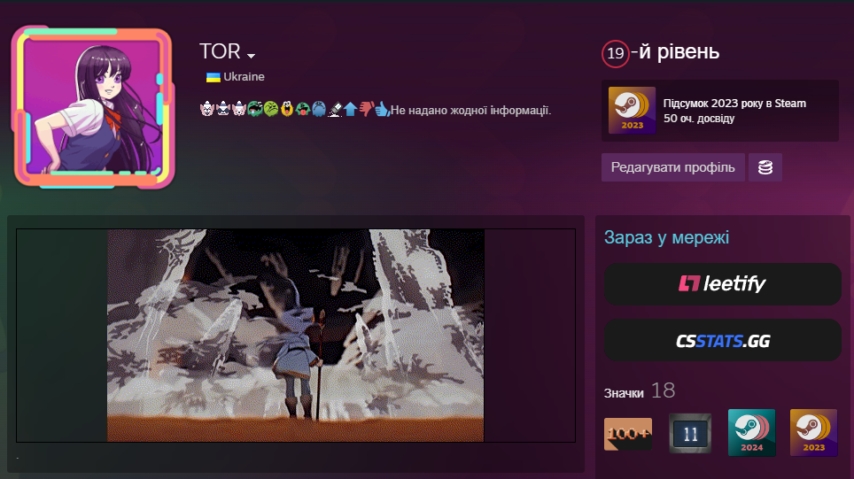
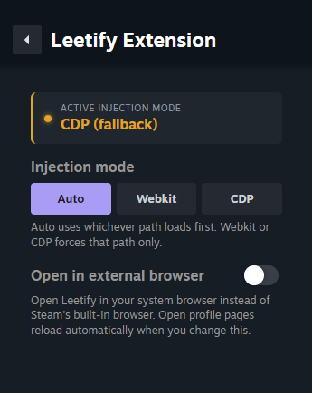

# Leetify Extension for Millennium

A Millennium plugin that integrates Leetify data and functionality directly into the Steam client, providing enhanced Counter-Strike statistics and profile information.

## Prerequisites

Before installing this plugin, ensure you have:

-   **[Millennium](https://steambrew.app/)** installed and configured

### Example




### Millennium Library Manager


---

## Installation Guide

### Method 1: Millennium Plugin Installer (Recommended)

1. **Copy Plugin ID**

    Copy the following Plugin ID

2. **Install via Millennium**

    - Open Steam with Millennium installed
    - Go to **Millennium** → **Plugins**
    - Click on the **Install a plugin**
    - Paste the Plugin ID into the installer
    - Click **Install**
    - Restart Steam when prompted

### Method 2: Build from Source

#### Step 1: Clone the Repository

```bash
git clone https://github.com/TOR968/leetify-extension.git
cd leetify-extension
```

#### Step 2: Install Dependencies

**Install Node.js dependencies:**

```bash
bun install
```

#### Step 3: Build the Plugin

**For development:**

```bash
bun run dev
```

**For production:**

```bash
bun run build
```

#### Step 4: Install to Steam

**Option A: Copy to plugins directory**

```bash
# Windows
copy /R . "C:\Program Files (x86)\Steam\millennium\plugins\leetify-extension"

# Linux
cp -r . ~/.local/share/millennium/plugins/leetify-extension

# macOS
cp -r . ~/Library/Application\ Support/millennium/plugins/leetify-extension
```

---

## How it works

The webkit bundle ([webkit/index.tsx](webkit/index.tsx)) runs inside the Steam community
browser and injects the Leetify button with a small vanilla-DOM function
(`leetifyInjectMain` in [webkit/inject.ts](webkit/inject.ts)). Settings are stored by a
small Lua backend ([backend/main.lua](backend/main.lua)) and edited from the plugin's
settings panel in the Steam client.

## TypeScript type checking

```bash
npx tsc -p frontend/tsconfig.json --noEmit
npx tsc -p webkit/tsconfig.json --noEmit
```

## Links

-   [Millennium Framework](https://github.com/SteamClientHomebrew/Millennium)
-   [Leetify](https://leetify.com)
-   [Steam Client](https://store.steampowered.com/about/)
